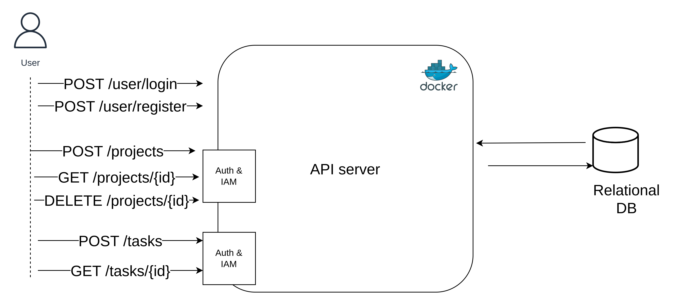
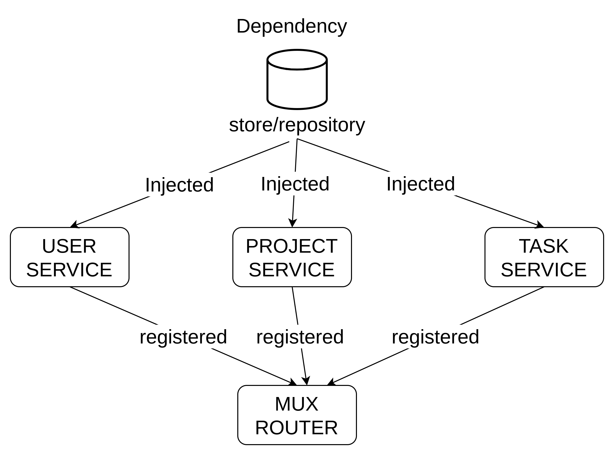

# golang-project-management-system

This repository is use golang to implement project management system

## component archiecture



## componenet dependency



## enviroment setup

| environment name | description |
|------------------|-------------|
| PORT             | api service port |
| DB_USER          | mysql user name  |
| DB_PASSWORD      | mysql password   |
| DB_HOST          | mysql hostname   |
| DB_PORT          | mysql port  default: 3306 |
| DB_NAME          | mysql database name |
| JWT_SECRET       | jwt secret   |

## for container healthy check for container start

```yaml
healthcheck:
  test: ["CMD", "mysqladmin" ,"ping", "-h", "localhost", "-uroot", "-p${MYSQL_ROOT_PASSWORD}"]
  interval: 5s
  timeout: 5s
  retries: 10
```

## start up service

```shell
docker compose up -d
```